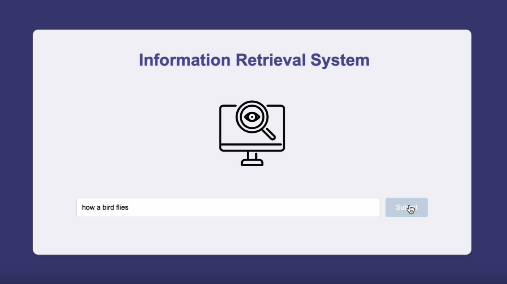
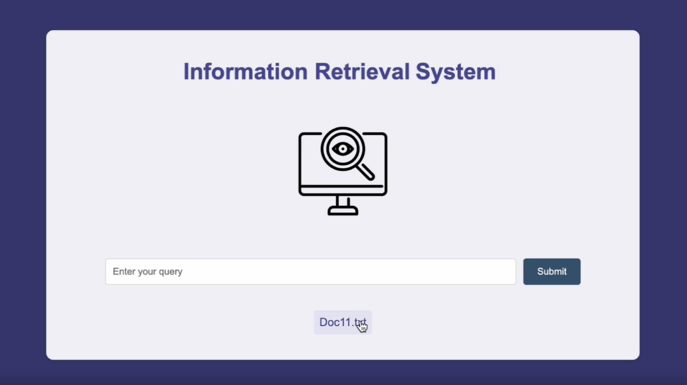
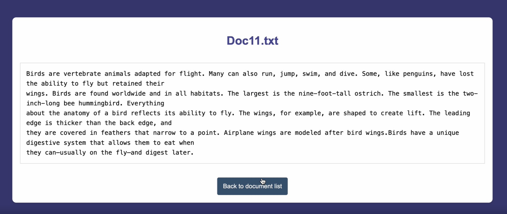

# Information Retrieval system
**Overview**
This project focuses on document preprocessing, term weighting, and information retrieval using a set of textual documents. The primary goal was to preprocess these documents, index them, and retrieve relevant information based on user queries using a similarity measure.

**Project Structure**
We worked with 12 textual documents in total, uploaded to Google Drive. Ten of these documents were about Data Structure, and the remaining two focused on Birds and Safran.

**Key Steps**
1. Data Collection:
- Uploaded 12 .txt files to Google Drive.
- Imported necessary libraries for data processing and connected the environment to Google Drive for easy access to documents.

2. Preprocessing:
- Tokenization: Split sentences into tokens, removed punctuation, and extra white spaces.
- Lowercasing: Converted all text to lowercase.
- Stop Word Removal: Removed common stop words to focus on important terms.
- Normalization: Applied both stemming and lemmatization to reduce words to their base or root forms.

3. Term Weighting:
Applied the TF-IDF (Term Frequency-Inverse Document Frequency) method to give weight to words based on their importance in the documents.

4. Query Processing and Indexing:
Allowed users to input queries, and used a dot product similarity measure to calculate and rank document relevance based on the query.
Returned a ranked list of documents ordered by similarity score.

5. Evaluation:
Evaluated the system using precision and recall to assess its performance.

**Features**
- Query-Based Document Retrieval: Users can input queries and get ranked results based on document similarity.
- TF-IDF Weighting: This ensures that commonly used words are down-weighted, and more meaningful terms receive higher scores.
- Evaluation Metrics: Includes precision and recall for testing the effectiveness of the retrieval system.

**User Query Input**

**Query Results**

**Document Details**

